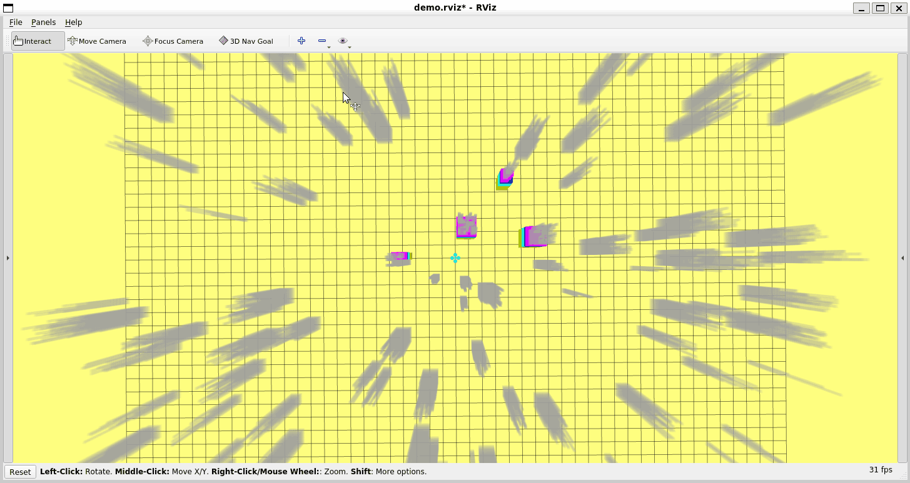

# mobile_robot_planning


## 基于前后端结合的无人机运动规划

任务：在随机环境中设置一个目标点，规划出现一条无碰撞可行的轨迹，并让无人机执行这条轨迹

前端：A*

后端：minimum snap

在工作空间下执行下面的命令

```
catkin_make
```

source 一下工作空间

```
source devel/setup.bash
```

终端输入如下命令，启动无人机初始环境，然后使用 `rviz` 中的 `3D Nav Goal` 设置目标点即可。

```
roslaunch trajectory_generator demo.launch
```




## hw_1

任务：启动rviz，在rviz中可视化出随机生成的地图

在hw_1的目录下执行下面的命令

```
catkin_make
```

source 一下工作空间

```
source devel/setup.bash
```

启动如下命令就可以在rviz中看到随机生成的地图了

```
roslaunch grid_path_searcher demo.launch
```


## hw_2

任务：在hw_1的基础上，验证基于搜索的A*算法

在hw_2的目录下执行下面的命令

```
catkin_make
```

source 一下工作空间

```
source devel/setup.bash
```

启动如下命令就可以在rviz中看到随机生成的地图了

```
roslaunch grid_path_searcher demo.launch
```

然后使用 `3D Nav Goal` 设置目标点，就可以得到一个从原点到目标点路径了


## hw_3

任务：验证RRT和RRT*算法

在hw_3的目录下执行下面的命令

```
catkin_make
```

source 一下工作空间

```
source devel/setup.bash
```

启动如下命令就可以在rviz中看到随机生成的地图了

```
roslaunch path_finder rviz.launch
```

然后使用 `3D Nav Goal` 设置起点和下一个目标点，就可以得到一个从原点到目标点路径了

RRT


RRT*


## hw_4

任务：OBVP (lattice planner 的一次规划)

在hw_4的目录下执行下面的命令

```
catkin_make
```

source 一下工作空间

```
source devel/setup.bash
```

启动如下命令就可以在rviz中看到随机生成的地图了

```
roslaunch grid_path_searcher demo.launch
```

然后使用 `3D Nav Goal` 设置起点和下一个目标点，就可以得到若干个路径了

绿色代表找出的最优轨迹
蓝色表示不发生碰撞的轨迹
红色表示发生碰撞的轨迹


公式手推


## hw_5

任务：无约束BIVP  minimum jerk

在hw_5的目录下执行下面的命令

```
catkin_make
```

source 一下工作空间

```
source devel/setup.bash
```

启动如下命令

```
roslaunch lec5_hw click_gen.launch
```

然后使用 `2D Nav Goal` 设置若干个点，就可以得到优化后的轨迹了


手推的公式


### reference

[1](https://blog.csdn.net/qq_42286607/article/details/124700538)  [2 ](https://blog.csdn.net/qq_37746927/article/details/136153560?spm=1001.2014.3001.5502) 

## hw_6

任务：实现mpc控制器

在hw_6的目录下执行下面的命令

```
catkin_make
```

source 一下工作空间

```
source devel/setup.bash
```

启动如下命令

```
roslaunch mpc_car simulation.launch
```

就能看到小车跟踪一条轨迹了


