# mobile_robot_planning


## 无人机规划规划

任务：在随机环境中设置一个目标点，规划出现一条无碰撞可行的轨迹，并让无人机执行这条轨迹

前端：A*

后端：minimum snap

在工作空间下执行下面的命令

```
catkin_make
```

source 一下工作空间

```
source devel/setup.bash
```

终端输入如下命令，启动无人机初始环境

```
roslaunch trajectory_generator demo.launch
```

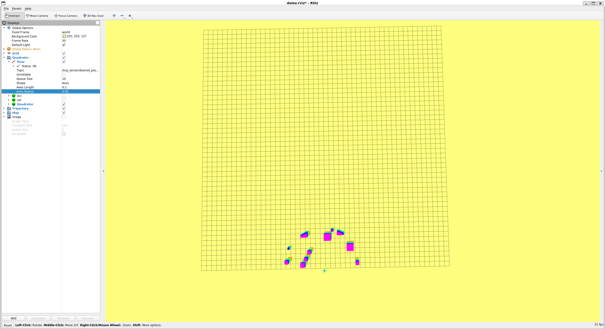


## 过程记录

### A*算法

#### getHeu函数

```c++
double AstarPathFinder::getHeu(GridNodePtr node1, GridNodePtr node2) {
  // using digonal distance and one type of tie_breaker.
  double h;

  double dx, dy, dz, hScore;

  dx = std::abs(node1->coord.x() - node2->coord.x());
  dy = std::abs(node1->coord.y() - node2->coord.y());
  dz = std::abs(node1->coord.z() - node2->coord.z());

  double min_xyz = std::min({ dx, dy, dz });
  hScore = dx + dy + dz + (std::sqrt(3.0) - 3) * min_xyz;

  // no tie_breaker
  // what is tie_breaker

  hScore = hScore * (1 + 1.0 / 10000);

  return h;
}
```


#### A*搜索

```c++
void AstarPathFinder::AstarGraphSearch(Vector3d start_pt, Vector3d end_pt) {

  // setlocale(LC_ALL, "");
  // ROS_INFO("调用A*算法寻找路径");

  ros::Time time_1 = ros::Time::now();

  // index of start_point and end_point
  Vector3i start_idx = coord2gridIndex(start_pt);
  Vector3i end_idx = coord2gridIndex(end_pt);
  goalIdx = end_idx;

  // position of start_point and end_point
  start_pt = gridIndex2coord(start_idx);
  end_pt = gridIndex2coord(end_idx);

  // Initialize the pointers of struct GridNode which represent start node and
  // goal node
  GridNodePtr startPtr = new GridNode(start_idx, start_pt);
  GridNodePtr endPtr = new GridNode(end_idx, end_pt);

  // openSet is the open_list implemented through multimap in STL library
  openSet.clear();
  // currentPtr represents the node with lowest f(n) in the open_list
  GridNodePtr currentPtr = NULL;
  GridNodePtr neighborPtr = NULL;

  // put start node in open set
  startPtr->gScore = 0;
  /**
   *
   * STEP 1.1:  finish the AstarPathFinder::getHeu
   *
   * **/
  startPtr->fScore = getHeu(startPtr, endPtr);

  startPtr->id = 1;
  startPtr->coord = start_pt;
  openSet.insert(make_pair(startPtr->fScore, startPtr));

  /**
   *
   * STEP 1.2:  some else preparatory works which should be done before while
   * loop
   *
   * **/

  double tentative_gScore; // for what ?
  vector<GridNodePtr> neighborPtrSets;
  vector<double> edgeCostSets;

  GridNodeMap[start_idx[0]][start_idx[1]][start_idx[2]] = startPtr;

  /**
   *
   * STEP 1.3:  finish the loop
   *
   * **/
   // while (!openSet.empty()) {
   // }

  while (!openSet.empty()) {
    /*
    *
    *
    step 3: Remove the node with lowest cost function from open set to closed set
    please write your code below

    IMPORTANT NOTE!!!
    This part you should use the C++ STL: multimap, more details can be find in Homework description
    *
    *
    */

    currentPtr = openSet.begin()->second;
    openSet.erase(openSet.begin());
    currentPtr->id = -1; // -1表示归入closed队列吗？

    // if the current node is the goal 
    if (currentPtr->index == goalIdx) {
      ros::Time time_2 = ros::Time::now();
      terminatePtr = currentPtr;
      ROS_WARN("[A*]{sucess}  Time in A*  is %f ms, path cost if %f m", (time_2 - time_1).toSec() * 1000.0, currentPtr->gScore * resolution);
      cout << "A* resolution" << resolution << endl;
      return;
    }
    //get the succetion
    AstarGetSucc(currentPtr, neighborPtrSets, edgeCostSets);  //STEP 4: finish AstarPathFinder::AstarGetSucc yourself     

    /*
    *
    *
    STEP 5:  For all unexpanded neigbors "m" of node "n", please finish this for loop
    please write your code below
    *
    */
    for (int i = 0; i < (int)neighborPtrSets.size(); i++) {
      /*
      *
      *
      Judge if the neigbors have been expanded
      please write your code below

      IMPORTANT NOTE!!!
      neighborPtrSets[i]->id = -1 : expanded, equal to this node is in close set
      neighborPtrSets[i]->id = 1 : unexpanded, equal to this node is in open set
      *
      */
      neighborPtr = neighborPtrSets[i];

      if (neighborPtr->id == 0) { //discover a new node, which is not in the closed set and open set
        /*
        *
        *
        STEP 6:  As for a new node, do what you need do ,and then put neighbor in open set and record it
        please write your code below
        *
        */
        neighborPtr->cameFrom = currentPtr;
        neighborPtr->gScore = currentPtr->gScore + edgeCostSets[i];
        neighborPtr->fScore = neighborPtr->gScore + getHeu(neighborPtr, currentPtr);
        neighborPtr->id = 1;
        openSet.insert(make_pair(neighborPtr->fScore, neighborPtr));
        continue;
      }
      else if (neighborPtr->id == 1) { //this node is in open set and need to judge if it needs to update, the "0" should be deleted when you are coding
        /*
        *
        *
        STEP 7:  As for a node in open set, update it , maintain the openset ,and then put neighbor in open set and record it
        please write your code below
        *
        */
        if (neighborPtr->gScore > currentPtr->gScore + edgeCostSets[i]) {
          neighborPtr->cameFrom = currentPtr;
          neighborPtr->gScore = currentPtr->gScore + edgeCostSets[i];
          neighborPtr->fScore = neighborPtr->gScore + getHeu(neighborPtr, endPtr);
        }


        continue;
      }
      else {//this node is in closed set
        /*
        *
        please write your code below
        *
        */
        // 什么都不用做吧 ?
        continue;
      }
    }
  }

  // if search fails
  ros::Time time_2 = ros::Time::now();
  if ((time_2 - time_1).toSec() > 0.1)
    ROS_WARN("Time consume in Astar path finding is %f",
      (time_2 - time_1).toSec());
}
```


#### RDP [参考](https://en.wikipedia.org/wiki/Ramer%E2%80%93Douglas%E2%80%93Peucker_algorithm)

```c++
vector<Vector3d> AstarPathFinder::RDP(const vector<Vector3d>& points, double epsilon) {
  if (points.size() < 3) {
    return points;
  }

  double dmax = 0.0;
  int index = 0;
  int end = points.size() - 1;

  for (int i = 1; i < end; i++) {
    double d = perpendicularDistance(points[i], points[0], points[end]);
    if (d > dmax) {
      index = i;
      dmax = d;
    }
  }

  vector<Vector3d> result;

  if (dmax > epsilon) {
    vector<Vector3d> recResults1 = RDP(vector<Vector3d>(points.begin(), points.begin() + index + 1), epsilon);
    vector<Vector3d> recResults2 = RDP(vector<Vector3d>(points.begin() + index, points.end()), epsilon);

    result.insert(result.end(), recResults1.begin(), recResults1.end() - 1);
    result.insert(result.end(), recResults2.begin(), recResults2.end());
  }
  else {
    result.push_back(points[0]);
    result.push_back(points[end]);
  }

  return result;
}

double AstarPathFinder::perpendicularDistance(const Vector3d& p, const Vector3d& p1, const Vector3d& p2) {
  double x = p1.x() - p2.x();
  double y = p1.y() - p2.y();
  double z = p1.z() - p2.z();

  double num = abs(x * (p1.y() - p.y()) - (p1.x() - p.x()) * y + p1.z() * (p1.x() - p.x()) - p1.x() * (p1.z() - p.z()));
  double den = sqrt(x * x + y * y + z * z);

  return num / den;
}

```


#### A* + RDP的效果

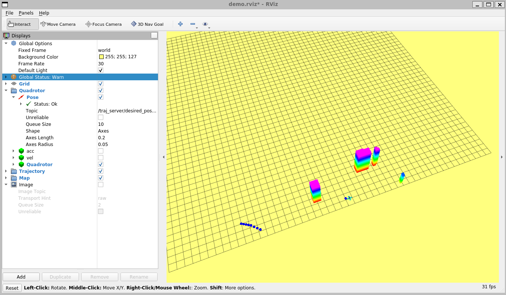


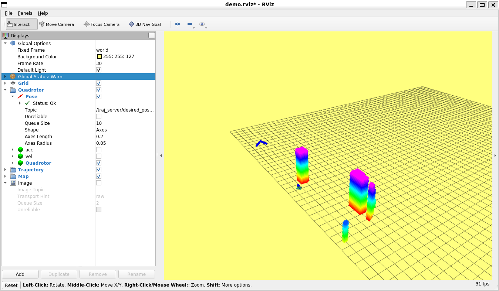

#### minimum snap


## 过程中遇到的问题

### 1.调试launch文件

在 `CMakeLists.txt ` 中添加  `SET(CMAKE_BUILD_TYPE Debug)`，编译后打断点即可调整整个launch文件

### 2.调试的时候总是不按顺序执行

不知道怎么解决


## hw_1

任务：启动rviz，在rviz中可视化出随机生成的地图

在hw_1的目录下执行下面的命令

```
catkin_make
```

source 一下工作空间

```
source devel/setup.bash
```

启动如下命令就可以在rviz中看到随机生成的地图了

```
roslaunch grid_path_searcher demo.launch
```

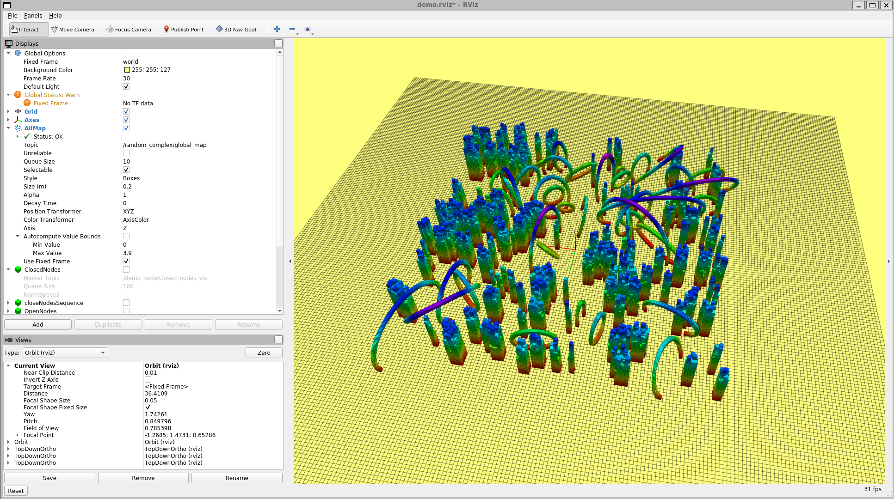


## hw_2

任务：在hw_1的基础上，验证基于搜索的A*算法

在hw_2的目录下执行下面的命令

```
catkin_make
```

source 一下工作空间

```
source devel/setup.bash
```

启动如下命令就可以在rviz中看到随机生成的地图了

```
roslaunch grid_path_searcher demo.launch
```

然后使用 `3D Nav Goal` 设置目标点，就可以得到一个从原点到目标点路径了

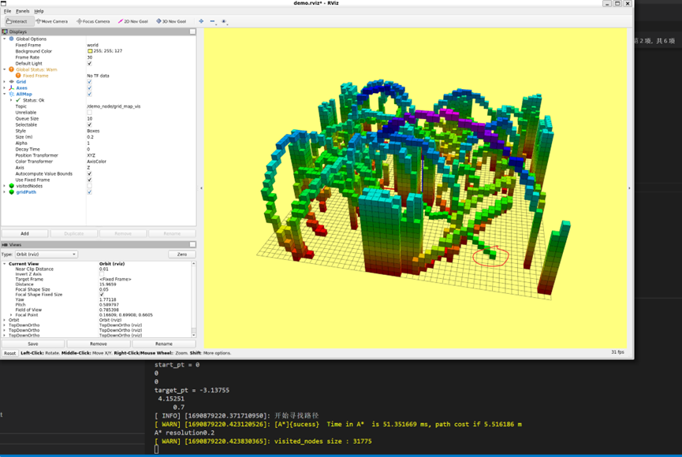


## hw_3

任务：验证RRT和RRT*算法

在hw_3的目录下执行下面的命令

```
catkin_make
```

source 一下工作空间

```
source devel/setup.bash
```

启动如下命令就可以在rviz中看到随机生成的地图了

```
roslaunch path_finder rviz.launch
```

然后使用 `3D Nav Goal` 设置起点和下一个目标点，就可以得到一个从原点到目标点路径了

RRT

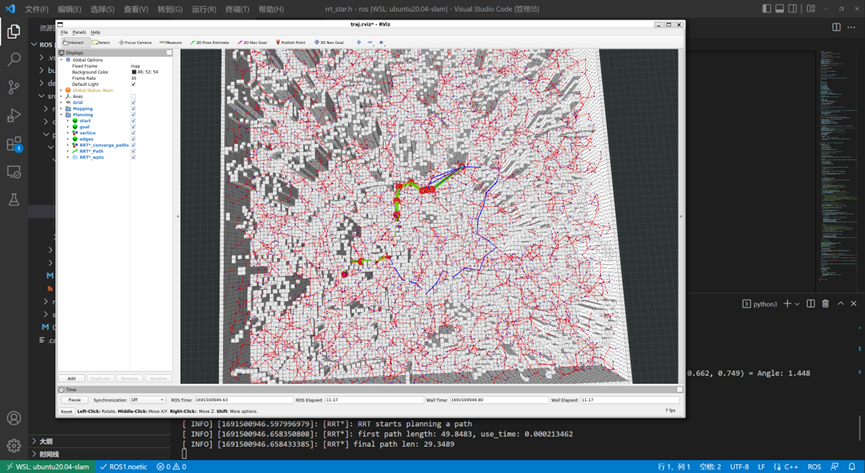

RRT*


## hw_4

任务：OBVP (lattice planner 的一次规划)

在hw_4的目录下执行下面的命令

```
catkin_make
```

source 一下工作空间

```
source devel/setup.bash
```

启动如下命令就可以在rviz中看到随机生成的地图了

```
roslaunch grid_path_searcher demo.launch
```

然后使用 `3D Nav Goal` 设置起点和下一个目标点，就可以得到若干个路径了

绿色代表找出的最优轨迹
蓝色表示不发生碰撞的轨迹
红色表示发生碰撞的轨迹

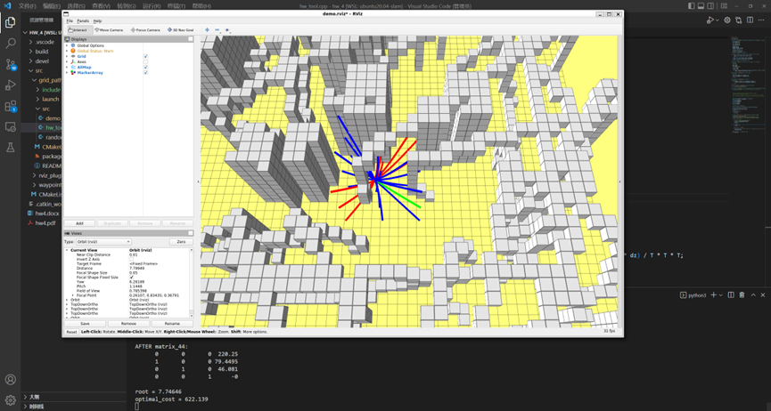

公式手推

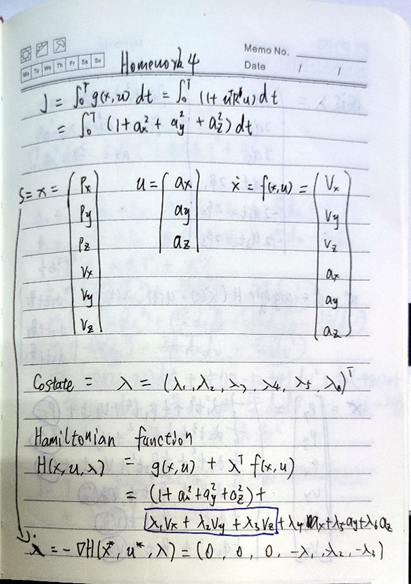

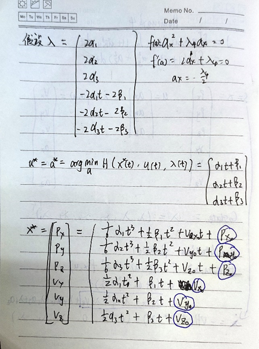

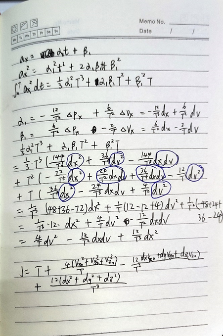


## hw_5

任务：无约束BIVP  minimum jerk

在hw_5的目录下执行下面的命令

```
catkin_make
```

source 一下工作空间

```
source devel/setup.bash
```

启动如下命令

```
roslaunch lec5_hw click_gen.launch
```

然后使用 `2D Nav Goal` 设置若干个点，就可以得到优化后的轨迹了

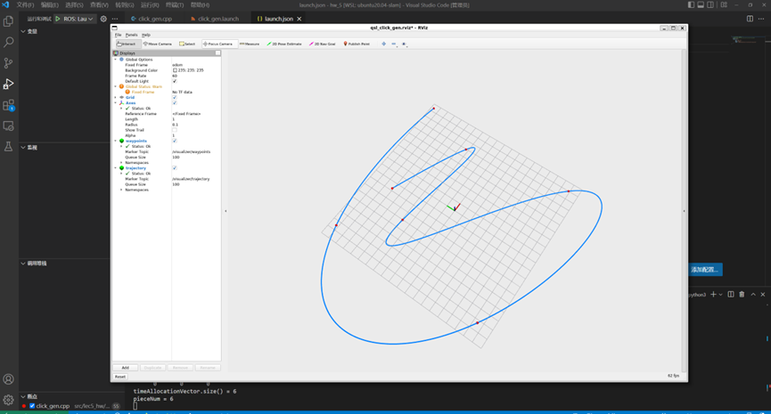

手推的公式

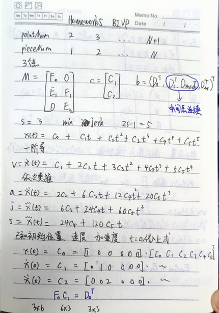

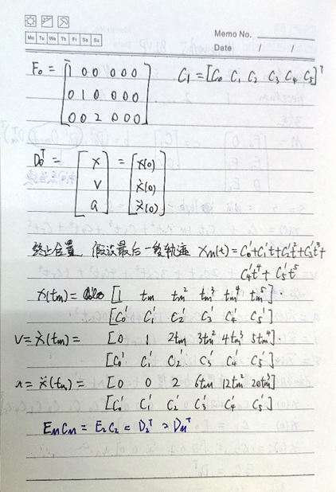

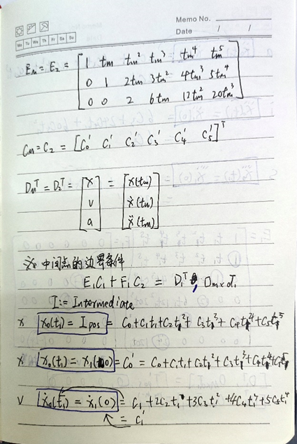

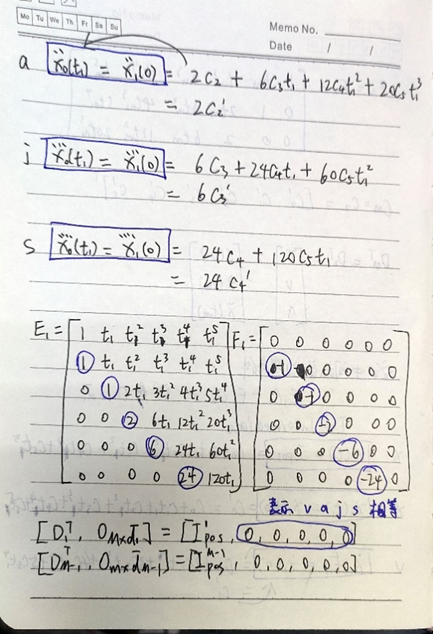


## hw_6

任务：实现mpc控制器

在hw_6的目录下执行下面的命令

```
catkin_make
```

source 一下工作空间

```
source devel/setup.bash
```

启动如下命令

```
roslaunch mpc_car simulation.launch
```

就能看到小车跟踪一条轨迹了

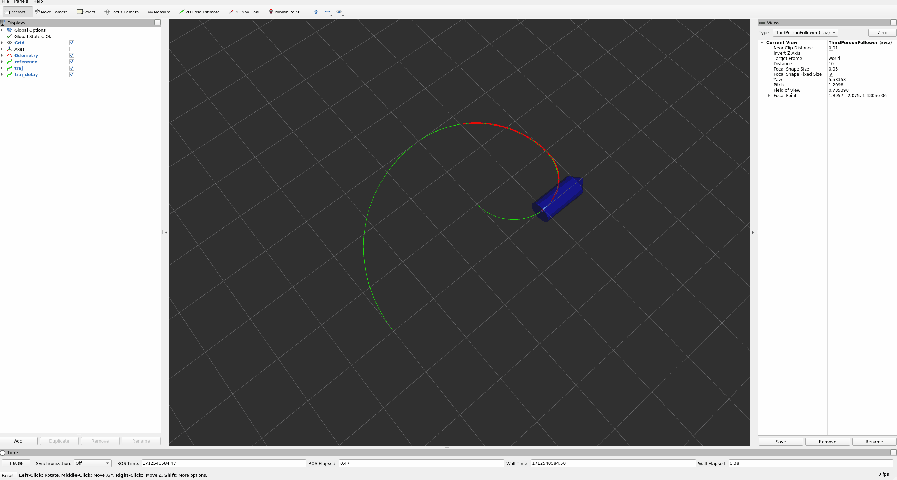
