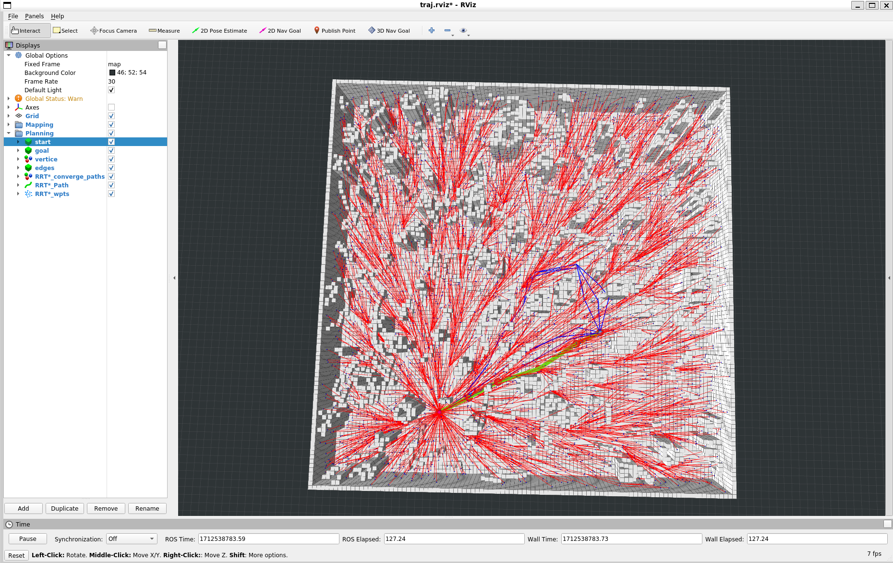

# mobile_robot_planning


## 无人机规划规划

任务：在随机环境中设置一个目标点，规划出现一条无碰撞可行的轨迹，并让无人机执行这条轨迹

前端：A*

后端：minimum snap

在工作空间下执行下面的命令

```
catkin_make
```

source 一下工作空间

```
source devel/setup.bash
```

终端输入如下命令，启动无人机初始环境

```
roslaunch trajectory_generator demo.launch
```


## 过程记录

### A*算法

#### getHeu函数

```c++
double AstarPathFinder::getHeu(GridNodePtr node1, GridNodePtr node2) {
  // using digonal distance and one type of tie_breaker.
  double h;

  double dx, dy, dz, hScore;

  dx = std::abs(node1->coord.x() - node2->coord.x());
  dy = std::abs(node1->coord.y() - node2->coord.y());
  dz = std::abs(node1->coord.z() - node2->coord.z());

  double min_xyz = std::min({ dx, dy, dz });
  hScore = dx + dy + dz + (std::sqrt(3.0) - 3) * min_xyz;

  // no tie_breaker

  hScore = hScore * (1 + 1.0 / 10000);

  return h;
}
```


#### A*搜索

```c++
void AstarPathFinder::AstarGraphSearch(Vector3d start_pt, Vector3d end_pt) {

  // setlocale(LC_ALL, "");
  // ROS_INFO("调用A*算法寻找路径");

  ros::Time time_1 = ros::Time::now();

  // index of start_point and end_point
  Vector3i start_idx = coord2gridIndex(start_pt);
  Vector3i end_idx = coord2gridIndex(end_pt);
  goalIdx = end_idx;

  // position of start_point and end_point
  start_pt = gridIndex2coord(start_idx);
  end_pt = gridIndex2coord(end_idx);

  // Initialize the pointers of struct GridNode which represent start node and
  // goal node
  GridNodePtr startPtr = new GridNode(start_idx, start_pt);
  GridNodePtr endPtr = new GridNode(end_idx, end_pt);

  // openSet is the open_list implemented through multimap in STL library
  openSet.clear();
  // currentPtr represents the node with lowest f(n) in the open_list
  GridNodePtr currentPtr = NULL;
  GridNodePtr neighborPtr = NULL;

  // put start node in open set
  startPtr->gScore = 0;
  /**
   *
   * STEP 1.1:  finish the AstarPathFinder::getHeu
   *
   * **/
  startPtr->fScore = getHeu(startPtr, endPtr);

  startPtr->id = 1;
  startPtr->coord = start_pt;
  openSet.insert(make_pair(startPtr->fScore, startPtr));

  /**
   *
   * STEP 1.2:  some else preparatory works which should be done before while
   * loop
   *
   * **/

  double tentative_gScore; // for what ?
  vector<GridNodePtr> neighborPtrSets;
  vector<double> edgeCostSets;

  GridNodeMap[start_idx[0]][start_idx[1]][start_idx[2]] = startPtr;

  /**
   *
   * STEP 1.3:  finish the loop
   *
   * **/
   // while (!openSet.empty()) {
   // }

  while (!openSet.empty()) {
    /*
    *
    *
    step 3: Remove the node with lowest cost function from open set to closed set
    please write your code below

    IMPORTANT NOTE!!!
    This part you should use the C++ STL: multimap, more details can be find in Homework description
    *
    *
    */

    currentPtr = openSet.begin()->second;
    openSet.erase(openSet.begin());
    currentPtr->id = -1; // -1表示归入closed队列吗？

    // if the current node is the goal 
    if (currentPtr->index == goalIdx) {
      ros::Time time_2 = ros::Time::now();
      terminatePtr = currentPtr;
      ROS_WARN("[A*]{sucess}  Time in A*  is %f ms, path cost if %f m", (time_2 - time_1).toSec() * 1000.0, currentPtr->gScore * resolution);
      cout << "A* resolution" << resolution << endl;
      return;
    }
    //get the succetion
    AstarGetSucc(currentPtr, neighborPtrSets, edgeCostSets);  //STEP 4: finish AstarPathFinder::AstarGetSucc yourself     

    /*
    *
    *
    STEP 5:  For all unexpanded neigbors "m" of node "n", please finish this for loop
    please write your code below
    *
    */
    for (int i = 0; i < (int)neighborPtrSets.size(); i++) {
      /*
      *
      *
      Judge if the neigbors have been expanded
      please write your code below

      IMPORTANT NOTE!!!
      neighborPtrSets[i]->id = -1 : expanded, equal to this node is in close set
      neighborPtrSets[i]->id = 1 : unexpanded, equal to this node is in open set
      *
      */
      neighborPtr = neighborPtrSets[i];

      if (neighborPtr->id == 0) { //discover a new node, which is not in the closed set and open set
        /*
        *
        *
        STEP 6:  As for a new node, do what you need do ,and then put neighbor in open set and record it
        please write your code below
        *
        */
        neighborPtr->cameFrom = currentPtr;
        neighborPtr->gScore = currentPtr->gScore + edgeCostSets[i];
        neighborPtr->fScore = neighborPtr->gScore + getHeu(neighborPtr, currentPtr);
        neighborPtr->id = 1;
        openSet.insert(make_pair(neighborPtr->fScore, neighborPtr));
        continue;
      }
      else if (neighborPtr->id == 1) { //this node is in open set and need to judge if it needs to update, the "0" should be deleted when you are coding
        /*
        *
        *
        STEP 7:  As for a node in open set, update it , maintain the openset ,and then put neighbor in open set and record it
        please write your code below
        *
        */
        if (neighborPtr->gScore > currentPtr->gScore + edgeCostSets[i]) {
          neighborPtr->cameFrom = currentPtr;
          neighborPtr->gScore = currentPtr->gScore + edgeCostSets[i];
          neighborPtr->fScore = neighborPtr->gScore + getHeu(neighborPtr, endPtr);
        }


        continue;
      }
      else {//this node is in closed set
        /*
        *
        please write your code below
        *
        */
        // 什么都不用做吧 ?
        continue;
      }
    }
  }

  // if search fails
  ros::Time time_2 = ros::Time::now();
  if ((time_2 - time_1).toSec() > 0.1)
    ROS_WARN("Time consume in Astar path finding is %f",
      (time_2 - time_1).toSec());
}
```


#### RDP [参考](https://en.wikipedia.org/wiki/Ramer%E2%80%93Douglas%E2%80%93Peucker_algorithm)

```c++
vector<Vector3d> AstarPathFinder::RDP(const vector<Vector3d>& points, double epsilon) {
  if (points.size() < 3) {
    return points;
  }

  double dmax = 0.0;
  int index = 0;
  int end = points.size() - 1;

  for (int i = 1; i < end; i++) {
    double d = perpendicularDistance(points[i], points[0], points[end]);
    if (d > dmax) {
      index = i;
      dmax = d;
    }
  }

  vector<Vector3d> result;

  if (dmax > epsilon) {
    vector<Vector3d> recResults1 = RDP(vector<Vector3d>(points.begin(), points.begin() + index + 1), epsilon);
    vector<Vector3d> recResults2 = RDP(vector<Vector3d>(points.begin() + index, points.end()), epsilon);

    result.insert(result.end(), recResults1.begin(), recResults1.end() - 1);
    result.insert(result.end(), recResults2.begin(), recResults2.end());
  }
  else {
    result.push_back(points[0]);
    result.push_back(points[end]);
  }

  return result;
}

double AstarPathFinder::perpendicularDistance(const Vector3d& p, const Vector3d& p1, const Vector3d& p2) {
  // 计算直线方向向量
  Vector3d lineVec = p2 - p1;
  // 计算p到p1的向量和p到p2的向量的叉乘的模长
  double num = ((p - p1).cross(p - p2)).norm();
  // 计算直线方向向量的模长
  double den = lineVec.norm();

  return num / den;
}

vector<Vector3d> AstarPathFinder::pathSimplify(const vector<Vector3d>& path,
  double path_resolution) {
  vector<Vector3d> subPath;
  /**
   *
   * STEP 2.1:  implement the RDP algorithm
   *
   * **/

  subPath = RDP(path, path_resolution);

  return subPath;
}
```


#### A* + RDP的效果


### timeAllocation

```c++
double timeTrapzVel(const double dist,
  const double vel,
  const double acc)
{
  const double t = vel / acc;
  const double d = 0.5 * acc * t * t;

  if (dist < d + d)
  {
    return 2.0 * sqrt(dist / acc);
  }
  else
  {
    return 2.0 * t + (dist - 2.0 * d) / vel;
  }
}

VectorXd timeAllocation(MatrixXd Path) {
  VectorXd time(Path.rows() - 1);

  // cout << "_Vel = " << _Vel << endl; // 3
  // cout << "_Acc = " << _Acc << endl; // 2

  for (int i = 0; i < time.size(); i++) {
    double dist = 0.0;
    for (int j = 0; j < Path.cols(); ++j) {
      double diff = Path(i + 1, j) - Path(i, j);
      dist += diff * diff;
    }
    dist = sqrt(dist);
    time(i) = timeTrapzVel(dist, _Vel, _Acc);
  }

  cout << "time: " << endl;
  for (int i = 0; i < time.size(); i++) {
    std::cout << "time[" << i << "]: ";
    cout << time(i) << endl;
  }

  return time;
}
```


#### minimum snap

```c++
Eigen::MatrixXd TrajectoryGeneratorWaypoint::PolyQPGeneration(
  const int d_order,           // the order of derivative
  const Eigen::MatrixXd& Path, // waypoints coordinates (3d)
  const Eigen::MatrixXd& Vel,  // boundary velocity
  const Eigen::MatrixXd& Acc,  // boundary acceleration
  const Eigen::VectorXd& Time) // time allocation in each segment
{
  // enforce initial and final velocity and accleration, for higher order
  // derivatives, just assume them be 0;
  int p_order = 2 * d_order - 1; // the order of polynomial
  int p_num1d = p_order + 1;     // the number of variables in each segment

  int m = Time.size();
  MatrixXd PolyCoeff(m, 3 * p_num1d);

  std::cout << "PolyCoeff shape: " << PolyCoeff.rows() << " x " << PolyCoeff.cols() << std::endl;

  /**
   *
   * STEP 3.2:  generate a minimum-snap piecewise monomial polynomial-based
   * trajectory
   *
   * **/

  int pieceNum = Path.rows() - 1;


  // Get the first point from Path
  Eigen::Vector3d initialPos = Path.row(0);

  // Get the last point from Path
  Eigen::Vector3d terminalPos = Path.row(Path.rows() - 1);


  /* way1 闭式解 */

  Eigen::Vector3d initialVel = Vel.row(0);
  Eigen::Vector3d initialAcc = Acc.row(0);
  Eigen::Vector3d terminalVel = Vel.row(1);
  Eigen::Vector3d terminalAcc = Acc.row(1);

  Eigen::MatrixXd M = Eigen::MatrixXd::Zero(8 * pieceNum, 8 * pieceNum);
  Eigen::MatrixXd b = Eigen::MatrixXd::Zero(8 * pieceNum, 3);

  // START
  Eigen::MatrixXd F_0(4, 8);
  F_0 << 1, 0, 0, 0, 0, 0, 0, 0,
    0, 1, 0, 0, 0, 0, 0, 0,
    0, 0, 2, 0, 0, 0, 0, 0,
    0, 0, 0, 6, 0, 0, 0, 0;
  M.block(0, 0, 4, 8) = F_0;
  b.block(0, 0, 4, 3) << initialPos(0), initialPos(1), initialPos(2),
    initialVel(0), initialVel(1), initialVel(2),
    initialAcc(0), initialAcc(1), initialAcc(2),
    0, 0, 0; //最后一行为jerk

  std::cout << "F_0" << std::endl;
  std::cout << M.block(0, 0, 4, 8) << std::endl;

  std::cout << "b_0" << std::endl;
  std::cout << b.block(0, 0, 4, 3) << std::endl;

  cout << "pieceNum = " << pieceNum << endl;
  for (int i = 0; i < m; i++) {
    cout << "Time[" << i << "] = " << Time(i) << endl;
  }

  cout << "Time(pieceNum - 1) = " << Time(pieceNum - 1) << endl;

  // END
  double t(Time(pieceNum - 1)); // 最后一段时间
  Eigen::MatrixXd E_M(4, 8);
  E_M << 1, t, pow(t, 2), pow(t, 3), pow(t, 4), pow(t, 5), pow(t, 6), pow(t, 7),
    0, 1, 2 * t, 3 * pow(t, 2), 4 * pow(t, 3), 5 * pow(t, 4), 6 * pow(t, 5), 7 * pow(t, 6),
    0, 0, 2, 6 * t, 12 * pow(t, 2), 20 * pow(t, 3), 30 * pow(t, 4), 42 * pow(t, 5),
    0, 0, 0, 6, 24 * t, 60 * pow(t, 2), 120 * pow(t, 3), 210 * pow(t, 4);
  M.block(8 * pieceNum - 4, 8 * (pieceNum - 1), 4, 8) = E_M;
  b.block(8 * pieceNum - 4, 0, 4, 3) << terminalPos(0), terminalPos(1), terminalPos(2),
    terminalVel(0), terminalVel(1), terminalVel(2),
    terminalAcc(0), terminalAcc(1), terminalAcc(2),
    0, 0, 0; // 最后一行为jerk

  std::cout << "E_M" << std::endl;
  std::cout << M.block(8 * pieceNum - 4, 8 * (pieceNum - 1), 4, 8) << std::endl;

  std::cout << "b_M" << std::endl;
  std::cout << b.block(8 * pieceNum - 4, 0, 4, 3) << std::endl;

  cout << "start & end is ok!" << endl;

  for (int i = 1; i < pieceNum; i++) { //第二个到倒数第二个
    double t(Time(i - 1));
    Eigen::MatrixXd F_i(8, 8), E_i(8, 8);

    // Eigen::Vector3d D_i(intermediatePositions.transpose().row(i - 1));
    Eigen::Vector3d D_i(Path.row(i).transpose());

    E_i << 1, t, pow(t, 2), pow(t, 3), pow(t, 4), pow(t, 5), pow(t, 6), pow(t, 7),
      1, t, pow(t, 2), pow(t, 3), pow(t, 4), pow(t, 5), pow(t, 6), pow(t, 7),
      0, 1, 2 * t, 3 * pow(t, 2), 4 * pow(t, 3), 5 * pow(t, 4), 6 * pow(t, 5), 7 * pow(t, 6),
      0, 0, 2, 6 * t, 12 * pow(t, 2), 20 * pow(t, 3), 30 * pow(t, 4), 42 * pow(t, 5),
      0, 0, 0, 6, 24 * t, 60 * pow(t, 2), 120 * pow(t, 3), 210 * pow(t, 4),
      0, 0, 0, 0, 24, 120 * t, 360 * pow(t, 2), 840 * pow(t, 3),
      0, 0, 0, 0, 0, 120, 720 * t, 2520 * pow(t, 2),
      0, 0, 0, 0, 0, 0, 720, 5040 * t;
    F_i << 0, 0, 0, 0, 0, 0, 0, 0,
      -1, 0, 0, 0, 0, 0, 0, 0,
      0, -1, 0, 0, 0, 0, 0, 0,
      0, 0, -2, 0, 0, 0, 0, 0,
      0, 0, 0, -6, 0, 0, 0, 0,
      0, 0, 0, 0, -24, 0, 0, 0,
      0, 0, 0, 0, 0, -120, 0, 0,
      0, 0, 0, 0, 0, 0, -720, 0;
    int j = 8 * (i - 1);
    M.block(4 + 8 * (i - 1), j + 8, 8, 8) = F_i;
    M.block(4 + 8 * (i - 1), j, 8, 8) = E_i;
    b.block(4 + 8 * (i - 1), 0, 8, 3) << D_i(0), D_i(1), D_i(2),
      0, 0, 0,
      0, 0, 0,
      0, 0, 0,
      0, 0, 0,
      0, 0, 0,
      0, 0, 0,
      0, 0, 0;
  }
  Eigen::MatrixX3d coefficientMatrix;
  coefficientMatrix = M.inverse() * b;

  // Output the shape and size of M, b, and coefficientMatrix
  std::cout << "Shape and size of M: " << M.rows() << "x" << M.cols() << std::endl;
  std::cout << "Shape and size of b: " << b.rows() << "x" << b.cols() << std::endl;
  std::cout << "Shape and size of coefficientMatrix: " << coefficientMatrix.rows() << "x" << coefficientMatrix.cols() << std::endl;

  std::cout << "coefficientMatrix = " << std::endl;
  std::cout << coefficientMatrix << std::endl;

  // coefficientMatrix 2 PolyCoeff
  // coefficientMatrix (pieceNum * 8) * 3， 每一行表示的是x y z的一个系数 每8行3列表示的是一段轨迹的x y z的多项式系数 从低到高
  // PolyCoeff pieceNum * (8 * 3) = pieceNum * 24，其中24表示的是一段轨迹的x y z的7阶多项式系数的个数，按照xyz和从低到高的顺序排列

  MatrixXd tmpPolyCoeff(m, 3 * p_num1d);
  // MatrixXd tmpPolyCoeff;

  for (int i = 0; i < m; ++i) {
    // 对于每个路径段
    for (int j = 0; j < p_num1d; ++j) {
      // j 表示当前多项式系数的索引
      // 这里我们需要将coefficientMatrix对应路径段的系数按顺序赋值到PolyCoeff中
      tmpPolyCoeff(i, j) = coefficientMatrix(i * 8 + j, 0); // X方向
      tmpPolyCoeff(i, j + p_num1d) = coefficientMatrix(i * 8 + j, 1); // Y方向
      tmpPolyCoeff(i, j + 2 * p_num1d) = coefficientMatrix(i * 8 + j, 2); // Z方向
    }
  }
  std::cout << "Shape and size of tmpPolyCoeff: " << tmpPolyCoeff.rows() << "x" << tmpPolyCoeff.cols() << std::endl;
  std::cout << "tmpPolyCoeff = " << std::endl;
  std::cout << tmpPolyCoeff << std::endl;

  PolyCoeff = tmpPolyCoeff;

  return PolyCoeff;
}
```


reference
[1](https://blog.csdn.net/u011341856/article/details/121861930)


## 过程中遇到的问题

### 1.调试launch文件

在 `CMakeLists.txt ` 中添加  `SET(CMAKE_BUILD_TYPE Debug)`，编译后打断点即可调整整个launch文件

### 2.调试的时候总是不按顺序执行

不知道怎么解决

### 3.轨迹无法正常显示

把 `visTrajectory` 中的 `_traj_vis.header.frame_id = "/world";` 改为 _traj_vis.header.frame_id = "/world";

```c++
void visTrajectory(MatrixXd polyCoeff, VectorXd time) {
  visualization_msgs::Marker _traj_vis;

  _traj_vis.header.stamp = ros::Time::now();
  _traj_vis.header.frame_id = "world";

  _traj_vis.ns = "traj_node/trajectory";
  _traj_vis.id = 0;
  _traj_vis.type = visualization_msgs::Marker::SPHERE_LIST;
  _traj_vis.action = visualization_msgs::Marker::ADD;
  _traj_vis.scale.x = _vis_traj_width;
  _traj_vis.scale.y = _vis_traj_width;
  _traj_vis.scale.z = _vis_traj_width;
  _traj_vis.pose.orientation.x = 0.0;
  _traj_vis.pose.orientation.y = 0.0;
  _traj_vis.pose.orientation.z = 0.0;
  _traj_vis.pose.orientation.w = 1.0;

  _traj_vis.color.a = 1.0;
  _traj_vis.color.r = 0.0;
  _traj_vis.color.g = 0.5;
  _traj_vis.color.b = 1.0;

  _traj_vis.points.clear();
  Vector3d pos;
  geometry_msgs::Point pt;

  for (int i = 0; i < time.size(); i++) {
    for (double t = 0.0; t < time(i); t += 0.01) {
      pos = _trajGene->getPosPoly(polyCoeff, i, t);
      pt.x = pos(0);
      pt.y = pos(1);
      pt.z = pos(2);
      _traj_vis.points.push_back(pt);
    }
  }
  _traj_vis_pub.publish(_traj_vis);
}
```


## hw_1

任务：启动rviz，在rviz中可视化出随机生成的地图

在hw_1的目录下执行下面的命令

```
catkin_make
```

source 一下工作空间

```
source devel/setup.bash
```

启动如下命令就可以在rviz中看到随机生成的地图了

```
roslaunch grid_path_searcher demo.launch
```


## hw_2

任务：在hw_1的基础上，验证基于搜索的A*算法

在hw_2的目录下执行下面的命令

```
catkin_make
```

source 一下工作空间

```
source devel/setup.bash
```

启动如下命令就可以在rviz中看到随机生成的地图了

```
roslaunch grid_path_searcher demo.launch
```

然后使用 `3D Nav Goal` 设置目标点，就可以得到一个从原点到目标点路径了


## hw_3

任务：验证RRT和RRT*算法

在hw_3的目录下执行下面的命令

```
catkin_make
```

source 一下工作空间

```
source devel/setup.bash
```

启动如下命令就可以在rviz中看到随机生成的地图了

```
roslaunch path_finder rviz.launch
```

然后使用 `3D Nav Goal` 设置起点和下一个目标点，就可以得到一个从原点到目标点路径了

RRT


RRT*




## hw_4

任务：OBVP (lattice planner 的一次规划)

在hw_4的目录下执行下面的命令

```
catkin_make
```

source 一下工作空间

```
source devel/setup.bash
```

启动如下命令就可以在rviz中看到随机生成的地图了

```
roslaunch grid_path_searcher demo.launch
```

然后使用 `3D Nav Goal` 设置起点和下一个目标点，就可以得到若干个路径了

绿色代表找出的最优轨迹
蓝色表示不发生碰撞的轨迹
红色表示发生碰撞的轨迹


公式手推


## hw_5

任务：无约束BIVP  minimum jerk

在hw_5的目录下执行下面的命令

```
catkin_make
```

source 一下工作空间

```
source devel/setup.bash
```

启动如下命令

```
roslaunch lec5_hw click_gen.launch
```

然后使用 `2D Nav Goal` 设置若干个点，就可以得到优化后的轨迹了


手推的公式


### reference

[1](https://blog.csdn.net/qq_42286607/article/details/124700538)  [2 ](https://blog.csdn.net/qq_37746927/article/details/136153560?spm=1001.2014.3001.5502) 

## hw_6

任务：实现mpc控制器

在hw_6的目录下执行下面的命令

```
catkin_make
```

source 一下工作空间

```
source devel/setup.bash
```

启动如下命令

```
roslaunch mpc_car simulation.launch
```

就能看到小车跟踪一条轨迹了


